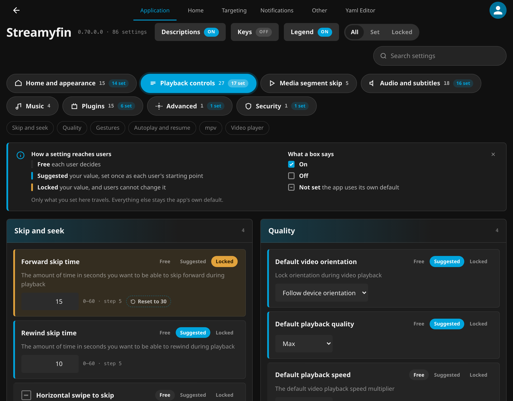
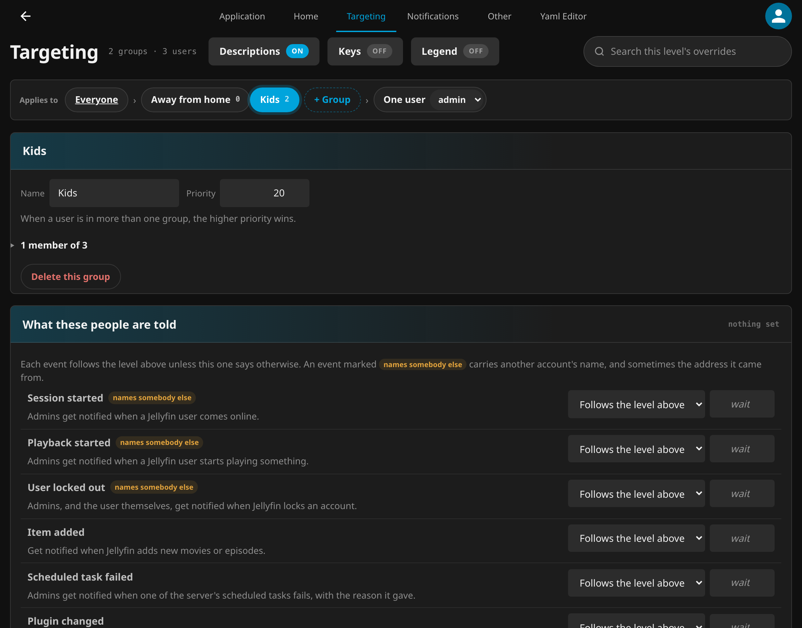
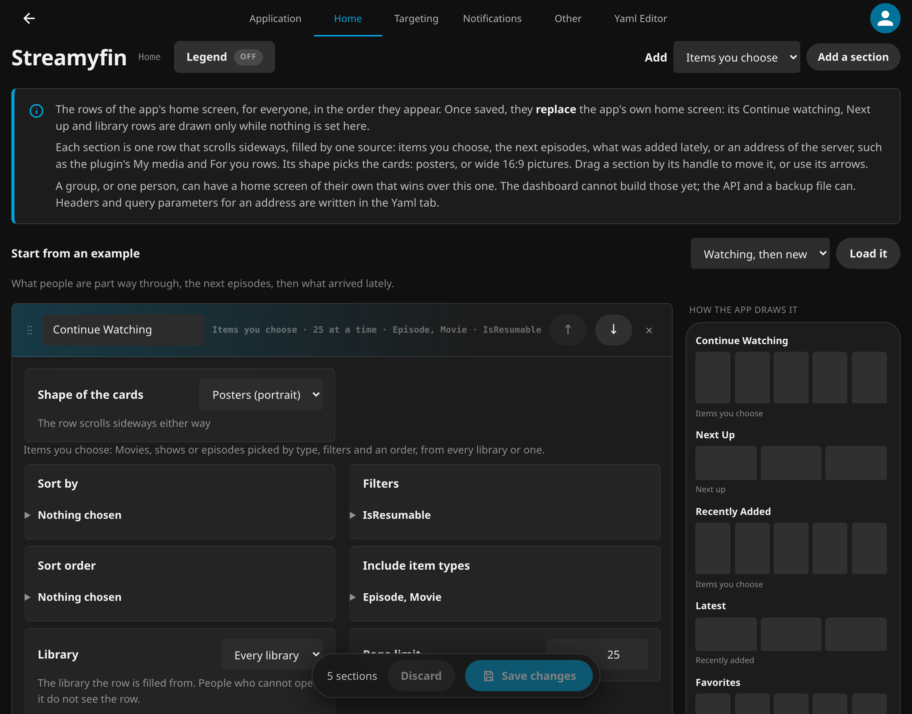
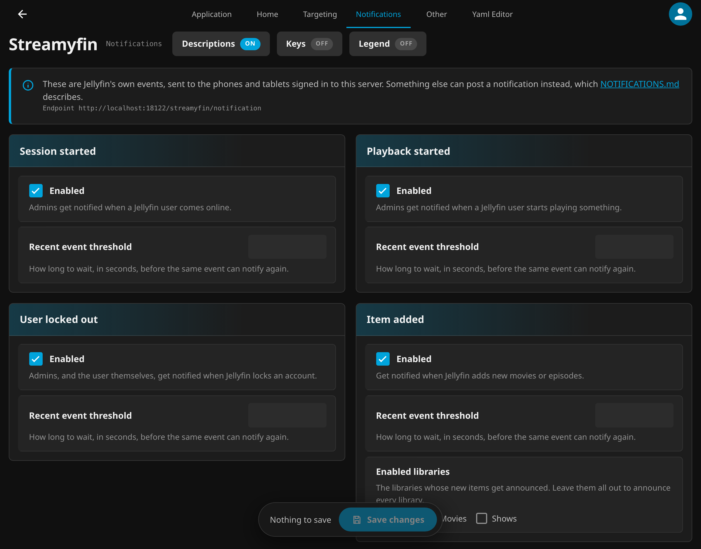
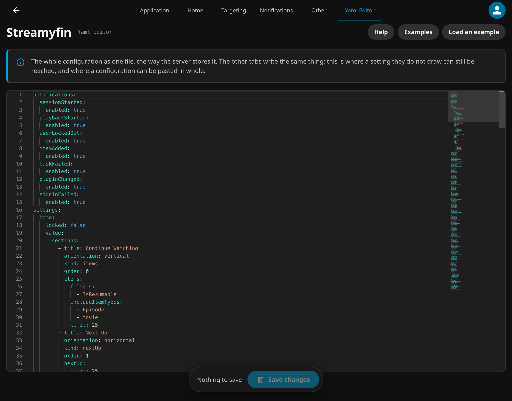

<p align="center">
  
</p>

<h3 align="center">The Jellyfin plugin behind the Streamyfin app.<br>Set up every device from your server, and reach them with notifications.</h3>

<p align="center">
  <a href="https://github.com/streamyfin/jellyfin-plugin-streamyfin/releases"></a>
  
  <a href="https://discord.streamyfin.app"></a>
  <a href="https://translate.streamyfin.app"></a>
  <a href="LICENSE"></a>
</p>

<p align="center">
  
</p>

> [!IMPORTANT]
> Needs **Jellyfin 10.11.9 or later, or Jellyfin 12**. One repository URL serves both: your server installs the build it can run.

> [!NOTE]
> This is the server half of [Streamyfin](https://github.com/streamyfin/streamyfin), the Jellyfin client for phones and TVs. The app works without it; with it, the people who run the server decide how the app is set up for everyone, and the server can send them notifications.

## Links

- [Install](#install)
- [Quick start](#quick-start)
- [Notifications guide](NOTIFICATIONS.md)
- [Configuration examples](examples/)
- [Streamyfin app](https://github.com/streamyfin/streamyfin)
- [Discord](https://discord.streamyfin.app)
- [Translate on Crowdin](https://translate.streamyfin.app)

## Features

| Feature | Dashboard tab | Needs |
| :--- | :--- | :--- |
| Every setting of the app, left to the user, suggested once, or locked, and put back to the app's own default in one click | Application | |
| Settings and notifications aimed at a group of users, or at one user | Targeting | |
| The rows of the app's home screen: dragged into order, started from an example, and previewed as the app draws them | Home | |
| Libraries picked by name, as the server has them, rather than typed as ids | Application, Home | |
| A "My media" row and a "For you" row built by the plugin | Home | |
| Push notifications for new media, sessions and playback | Notifications | |
| Admin alerts: a failed scheduled task, a plugin installed, updated or removed, a refused sign in, a locked account | Notifications | |
| Notifications in each device's language, translated into 29 languages | Notifications | Streamyfin app support, see [Languages](NOTIFICATIONS.md#languages) |
| Any notification from a script or another service, through one endpoint | Notifications | |
| The whole configuration as YAML, checked as you type | Yaml Editor | |
| A backup of everything, and a restore that checks it first | Other | |
| Sign in to Seerr from the app | Application | [Seerr](https://github.com/seerr-team/seerr) |
| Recommendations and promoted watchlists | Application | [Streamystats](https://github.com/fredrikburmester/streamystats) |
| Search through Marlin or Streamystats | Application | [Marlin](https://github.com/fredrikburmester/marlin-search) or Streamystats |

## Screenshots

<table>
  <tr>
    <td width="50%"></td>
    <td width="50%"></td>
  </tr>
  <tr>
    <td align="center"><em>Targeting: everyone, then groups by priority, then one user</em></td>
    <td align="center"><em>Home: the rows of the app's home screen, as the app draws them</em></td>
  </tr>
  <tr>
    <td width="50%"></td>
    <td width="50%"></td>
  </tr>
  <tr>
    <td align="center"><em>Notifications: one card per event</em></td>
    <td align="center"><em>Yaml Editor: the whole configuration in one file</em></td>
  </tr>
</table>

## Install

### From the catalogue (recommended)

1. In Jellyfin, open **Dashboard** → **Plugins** → **Catalog**.
2. Open the repository settings (the ⚙️ next to the title) and **add** a repository with this URL:
   ```
   https://raw.githubusercontent.com/streamyfin/jellyfin-plugin-streamyfin/main/manifest.json
   ```
3. Back in the catalogue, find **Streamyfin** and **install** it.
4. **Restart Jellyfin.**

One URL for every supported server. The plugin is built twice, once for Jellyfin 10.11 and once for Jellyfin 12, and both builds are listed in that file; your server picks the one it can run and never sees the other. Upgrading your server from 10.11 to 12 needs nothing changed here, and the next update is simply the right build.

### By hand

<details>
<summary>Only when the catalogue is not an option</summary>

Give it the `meta.json` in step 4 even though the plugin loads without one. Jellyfin does not refuse a folder that has none: it reads the name and version out of the folder name instead. What it cannot invent is the plugin's identity, so it uses the MD5 of the folder name as the id, the server never matches that to the catalogue entry, and **the plugin never receives an update again**. The file is what keeps it updatable.

1. Download the `.zip` for your Jellyfin version from [Releases](https://github.com/streamyfin/jellyfin-plugin-streamyfin/releases): `-jf11` for 10.11, `-jf12` for 12.
2. Create a folder named `Streamyfin_<version>` in your plugins directory:
   - **Linux**: `/var/lib/jellyfin/plugins/Streamyfin_0.70.0.0/`
   - **Windows**: `%AppData%\Jellyfin\Server\plugins\Streamyfin_0.70.0.0\`
   - **Docker**: `/config/plugins/Streamyfin_0.70.0.0/`
3. Extract **everything** from the zip into it, not only `Jellyfin.Plugin.Streamyfin.dll`. The other assemblies beside it are required, and without them Jellyfin logs "Failed to load assembly" and disables the plugin.
4. Add a `meta.json` in the same folder, keeping the `guid` exactly as it is since that is the whole point, and using the `targetAbi` of the line you downloaded (`10.11.9.0` for `-jf11`, `12.0.0.0` for `-jf12`):

   ```json
   {
     "guid": "1e9e5d38-6e67-4615-8719-e98a5c34f004",
     "name": "Streamyfin",
     "version": "0.70.0.0",
     "targetAbi": "12.0.0.0",
     "status": "Active",
     "autoUpdate": false,
     "assemblies": []
   }
   ```

   That is the `-jf12` file. For `-jf11`, the same line reads `"targetAbi": "10.11.9.0"`. Declaring an ABI higher than your server has it refuse the plugin, which is what copying this one unchanged onto a 10.11 server would do.

5. **Restart Jellyfin.**

10.11.9 is the floor for the 10.11 line rather than 10.11.0, because `IUserManager.Users` became `GetUsers()` inside that patch line. An older server refuses the plugin rather than loading it, and keeps running.

</details>

### Unstable builds

Work in progress, published so it can be tried on a real server before it is released. These are builds of the `develop` branch: they are not a release, they have not been through a release's checks, and one of them can break something the last release did correctly.

Add this URL the same way as above, beside the one you already have:

```
https://raw.githubusercontent.com/streamyfin/jellyfin-plugin-streamyfin/main/manifest-unstable.json
```

An unstable build is numbered above the release it follows: after 0.68.1.0 they are 0.68.1.1, 0.68.1.2 and so on, counting commits. The next release, 0.70.0.0, is above all of them, so **removing the unstable repository puts you back on the stable path by itself**: the next release is offered as an ordinary update. Nothing has to be uninstalled.

Keep both repositories and you are on the unstable channel, since its builds are the newer number until the next release goes out. That is the point of it, and it is the reason to remove the URL once you are done testing.

> [!TIP]
> Running Jellyfin 13 unstable? The 12 build is what installs there, and the same `manifest.json` serves it: `targetAbi` is the oldest server a build accepts rather than the only one. A build of its own comes when Jellyfin 13 needs one; [`Compat/README.md`](Jellyfin.Plugin.Streamyfin/Compat/README.md#jellyfin-13-as-of-2026-10-06) says where that stands.

### Going back to 0.68.1.0

<details>
<summary>The way back, and what it keeps</summary>

0.70.0.0 moves the configuration out of Jellyfin's plugin XML and the device registrations out of the old database, and never writes to either file again. The older version finds both as it left them:

1. Remove the unstable repository, if you added it.
2. **Dashboard** → **Plugins** → **Streamyfin** → **Uninstall**, then restart Jellyfin.
3. **Catalog** → **Streamyfin** → install **0.68.1.0**, then restart again.

Once a newer release is in the repository, the **Update Plugins** task installs it again at the next start, and the dashboard has no switch to stop that. To stay on 0.68.1.0, set `"autoUpdate": false` in `plugins/Streamyfin_0.68.1.0/meta.json` before restarting.

What the newer version stored stays in `data/streamyfin.db` and is there again when you update: groups, per user settings, and the configuration as you left it. Settings you change while on 0.68.1.0 are not carried back. The first start after the update names in the server log each one that now differs from what the newer version uses, so you can set it again in the dashboard. A setting you removed there is not named, since 0.68.1.0 also removes, whenever it saves, every setting it does not know. A device that signs in while 0.68.1.0 is running registers with 0.68.1.0 only, and registers again the next time the app starts after the update.

</details>

## Quick start

After installing, open **Dashboard** → **Streamyfin** (in the drawer, under Plugins). The page has six tabs:

| Tab | What it is for |
| :--- | :--- |
| **Application** | Every setting of the app, grouped as the app groups them. Each one is **Free** (left to the user), **Suggested** (your value, pushed once as their starting point) or **Locked** (your value, and the user cannot change it). **Reset**, beside a value, puts the app's own default back. |
| **Home** | The rows of the app's home screen, in order: drag them by their handle, start from an example, and see them the way the app draws them. |
| **Targeting** | The same settings and notifications for a group of users, or for one user. One user beats their groups, and a group beats everyone; between two groups, the higher priority wins. |
| **Notifications** | Which events send a notification, and to whom. |
| **Other** | The tab the plugin opens on, and backup and restore. |
| **Yaml Editor** | The whole configuration as one file, for what the other tabs do not draw. |

Pick a setting, choose **Locked**, and save. The legend at the top of each tab says what every state and every box means, and closes for good on the tab where you no longer need it.

The app picks the change up the next time it refreshes its settings, which it does each time it comes back to the foreground.

## Configuration examples

Everything below goes in the **Yaml Editor**, under the existing `settings:` key. Each setting is a `value` and whether it is `locked`.

### Lock the skip buttons

```yaml
settings:
  forwardSkipTime:
    locked: true
    value: 30
  rewindSkipTime:
    locked: true
    value: 15
```

### A home screen of your own

```yaml
settings:
  home:
    locked: false
    value:
      sections:
        - title: Continue Watching
          orientation: vertical
          items:
            filters: [IsResumable]
            includeItemTypes: [Episode, Movie]
            limit: 25
        - title: Trending Movies
          orientation: horizontal
          items:
            sortBy: [DateCreated]
            sortOrder: [Descending]
            includeItemTypes: [Movie]
            limit: 20
```

### A "My media" row

The libraries somebody can open, as a home row, the way Jellyfin's own home screen opens.

```yaml
        - title: My media
          orientation: horizontal
          custom:
            endpoint: /streamyfin/v1/my-media
```

It exists because Jellyfin's own `/UserViews` ignores `startIndex` and `limit`: asking for two rows starting at the third of three answers all three, so a row pointed straight at it repeats its libraries for as long as somebody keeps scrolling. This one pages, and answers what the caller can open and nothing else.

### A "For you" row, for servers without Streamystats

**If you run [Streamystats](https://github.com/fredrikburmester/streamystats), use its rows instead.** It recommends by vector similarity over the whole watch history and says which watched item led to each suggestion, the app already draws those rows, and the two switches that turn them on are in this plugin's settings, under Plugins → Streamystats. This row is for the servers that do not run it.

What it does then matters, because the alternative is not a worse recommendation but no recommendation: Jellyfin's own `/Items/Suggestions`, which is the app's "Suggested movies" row, is `OrderBy Random` on 10.11 and on master alike, and 10.11's `/Movies/Recommendations` builds each row with a query that never mentions the film the row is named after.

So the plugin works it out itself: it takes somebody's recently watched films and series, along with whatever they are watching right now, scores everything unwatched that shares a genre or a tag with any of them, and puts forward what several of them agree on. A studio in common counts towards the score once something is in the running. The weights are Jellyfin's own, from the similarity provider Jellyfin 12 ships.

```yaml
        - title: For you
          orientation: vertical
          custom:
            endpoint: /streamyfin/v1/for-you
```

The row is built for whoever is asking and for nobody else. Three optional parameters are there for libraries the defaults do not suit:

| Parameter | Default | What it does |
| :--- | :--- | :--- |
| `seeds` | 12 | How many recently watched things the row is built from |
| `perSeed` | 50 | How much of each of those counts |
| `limit` | 25 | How many the row answers with, per page |

```yaml
          custom:
            endpoint: /streamyfin/v1/for-you
            query:
              seeds: "25"
```

More in [examples/](examples/), including [every setting at once](examples/full.yml).

## Integrations

### Seerr

Sign your users in to [Seerr](https://github.com/seerr-team/seerr) (formerly Jellyseerr) from the app:

1. Set the **Seerr server URL** in the Application tab, under Plugins.
2. Make sure Seerr uses **Jellyfin authentication**.
3. The app signs users in when they open Seerr.

Optionally set the **Seerr API key** (Seerr → Settings → General) to let Streamyfin sign users in without a password, which also covers Quick Connect and OIDC accounts.

> [!WARNING]
> Every signed-in Jellyfin user can read this key, and it grants full admin access to the Seerr API. Only set it on a server where you trust every user. It needs a Seerr version with the `/user/jellyfin/{id}` route and a Streamyfin version with API key sign in.

### Streamystats

Personal recommendations and promoted watchlists from [Streamystats](https://github.com/fredrikburmester/streamystats): set its URL, then turn on movie or series recommendations and promoted watchlists.

### Marlin

Search through [Marlin](https://github.com/fredrikburmester/marlin-search): set its URL, then choose it as the **default search engine**. A search engine whose server URL is missing is not served: the app is given Jellyfin's search instead.

## Notifications

The plugin sends push notifications to the Streamyfin app through Expo: when something is added, when a session or a playback starts, and the admin alerts above. Each event can be turned off, aimed at a group or at one user, and written differently in any language. A script or another service can post its own through `/streamyfin/notification`.

The [notifications guide](NOTIFICATIONS.md) has the details, the endpoint and its payload, and examples for Seerr and for Jellyfin's own webhooks.

## Translations

The notifications' sentences live in `Jellyfin.Plugin.Streamyfin/Resources/Strings.resx`, with a comment saying what each placeholder stands for. Change that file only: the translations are made on [Crowdin](https://translate.streamyfin.app), in the `jellyfin-plugin-streamyfin` folder of the app's Streamyfin project, and come back as a pull request that writes the other `Strings.*.resx` files. A sentence not translated yet is sent in English.

## Development

The plugin builds for both Jellyfin lines from one tree. Jellyfin 12 is the default target:

```sh
dotnet build Jellyfin.Plugin.Streamyfin                        # Jellyfin 12, .NET 10
dotnet build Jellyfin.Plugin.Streamyfin -p:JellyfinTarget=jf11  # Jellyfin 10.11, .NET 9
make test JELLYFIN_TARGET=jf12                                  # the .NET tests
bun test                                                        # the dashboard pages' tests
```

Pull requests go to `develop`, with a [Conventional Commits](https://www.conventionalcommits.org) title. Every pull request is built for both targets, and its comment links the zips to try.

## Support

- Questions and help: [Discord](https://discord.streamyfin.app)
- Bugs and ideas: [issues](https://github.com/streamyfin/jellyfin-plugin-streamyfin/issues). Say which Jellyfin version you run, which build of the plugin (`-jf11` or `-jf12`), and the app version.

## Code signing

Free code signing provided by [SignPath.io](https://about.signpath.io/), certificate by [SignPath Foundation](https://signpath.org/).

## Licence

This plugin is released under the [Mozilla Public License 2.0](LICENSE), the same licence as the [Streamyfin app](https://github.com/streamyfin/streamyfin).

## Disclaimer

Streamyfin is developed by its community and is not affiliated with Jellyfin. The plugin does not provide, host or promote any media.
